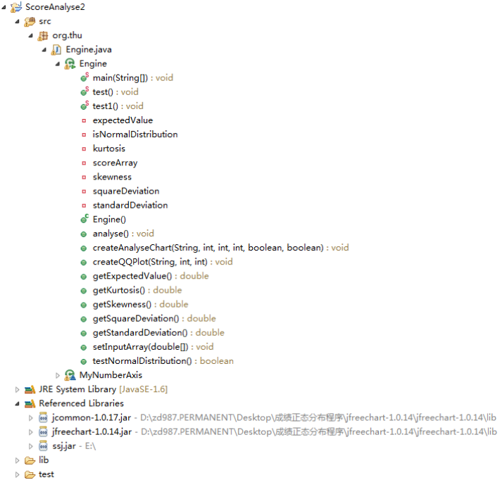
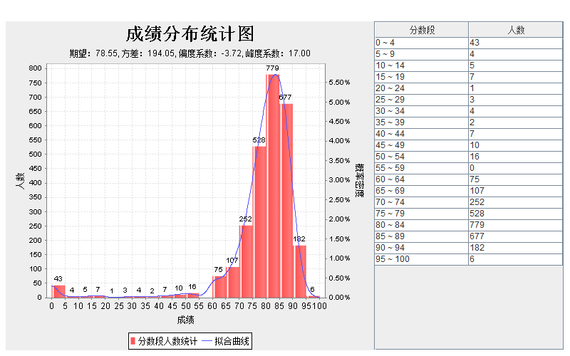
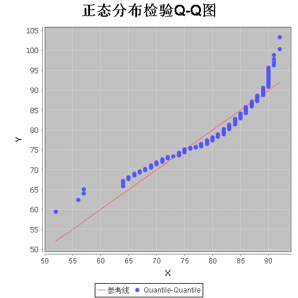
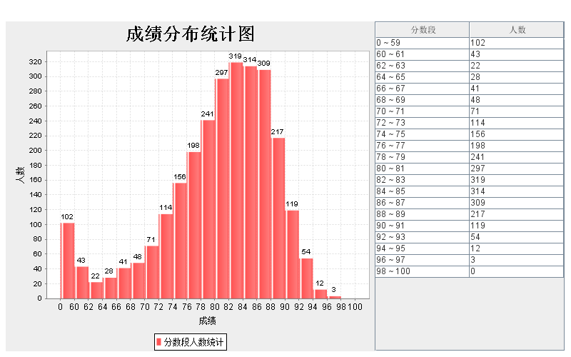

# 成绩正态分布分析接口

* 2012-12-06 更新：
添加拟合曲线功能，添加QQ图，添加偏度系数等在图例中的显示，更新文档及成绩分布规则说明。
* 2012-12-05 更新:
添加正态分布检验功能，通过偏度、峰度检验法来验证成绩是否服从正态分布。
* 2012-11-06 更新：
添加分数段区间自定义功能，添加不及格分数段合并选项功能。


## 1．设计说明
接口实现部分如下：
利用开源jar包JFreeChart的绘图功能实现。

主要类结构图如下：

  

在Eclipse使用时需要将额外的3个jar包放在编译的路径上，这些jar在项目的lib文件夹下都有存放。使用时候需要将成绩以double[]数组形式传入，函数调用接口为：

``` java
	 /** 设置输入数据
	 * @param scoreArray 成绩数组
	 */
	public void setInputArray(double[] scoreArray) 

	//获取平均值
	public double getExpectedValue()

	//获取标准差
	public double getStandardDeviation()

	//获取方差
	public double getSquareDeviation()

	//获取偏度系数
	public double getSkewness()

	/**
	 * @param filePath 要保存png文件的绝对路径
	 * @param width 图片宽度，样例用选取的图片宽度为800
	 * @param height 图片高度，样例中选取的图片高度为500
	 * @param step 分数段的步长，可以指定[1, 100]之间的任意整数
	 * @param mergeBelow60 布尔型变量，来设置是否合并不及格分数段
	 * @param displayFittedCurve 布尔型变量，来设置是否需要显示拟合曲线
	 */
	public void createAnalyseChart(String filePath, int width, int height, 
			int step, boolean mergeBelow60, boolean displayFittedCurve) 

	/** 
	 * @param filePath 要保存png文件的绝对路径
	 * @param width 图片宽度，样例用选取的图片宽度为500
	 * @param height 图片高度，样例中选取的图片高度为500
	 */
	public void createQQPlot(String filePath, int width, int height)
```
具体例子可以参考代码里的test()函数，主要是以下几句：
``` java
	int width = 800, height = 500;
	Engine e = new Engine();
	e.setInputArray(array);
	e.createAnalyseChart("D:/zd987.PERMANENT/Desktop/analyse.png", width, height, 10, false, true);
	e.createQQPlot("D:/zd987.PERMANENT/Desktop/QQ_plot.png", 500, 500);
```
## 2．正态分布检验
主要通过以下方式进行检验成绩是否符合正态分布：
原理详见[《元素正态分布偏度\_峰度检验法PC\_1500应用程序》](http://www.cnki.com.cn/Article/CJFDTotal-HJDZ199002013.htm)


使用方法在test1()函数里有介绍，主要代码如下：
``` java
	Engine e = new Engine();
	e.setInputArray(array);
	if(e.testNormalDistribution()) {
		System.out.println("成绩符合正态分布");
	} else {
		System.out.println("成绩不符合正态分布");
		if(e.getSkewness() > 0) {
			//偏度系数大于0
			System.out.println("成绩呈正偏态分布");
		} else {
			//偏度系数小于0
			System.out.println("成绩呈负偏态分布");
		}
		if(e.getKurtosis() > 0) {
			//峰度系数大于0
			System.out.println("成绩呈陡峭型分布");
		} else {
			//峰度系数小于0
			System.out.println("成绩呈平坡型分布");
		}
	}
```
成绩分布规则说明：
* __正态分布__: 说明测试结果与学生的实际情况一致,各种难度的项目比例合理。
* __正偏态分布__: 说明试题难度偏高,难度较大的项目比例偏大。呈这种分布的试题有利于将成绩优秀的学生和中等程度的学生区别开,但不利于将中等程度的学生和成绩较差的学生区别开。
* __负偏态分布__: 说明试题难度偏低,难度较低的项目比例偏大。呈这种分布的试题有利于将成绩较差的学生和中等程度的学生区别开,但不利于将中等程度的学生和成绩优秀的学生区别开。
* __平坡型分布__:说明试题中各种难度的项目比例接近,梯度较大。呈这种分布的试题区分度较高,但分数之间的差异偏大。
* __陡峭型分布__: 说明试题中同等难度的项目较多,梯度偏小。呈这种分布的试题几乎不能将不同程度的学生去分开,分数分布过于集中。
* __非正太分布__：有的测试为绝对评价(终结性考试) ,如毕业考试,英语、计算机等级考试,它要判断学生是否达到某一水平,因此考试的总体结果就不应该呈正态分布

## 3．效果展示

  

  

  

## 参考文献：
1. 考试系统中成绩正态分布检验的设计与实现,刘应成,重庆工学院学报 - Journal of Chongqing Institute of Technology, 2004, Vol.18(6), pp.188-189
2. 利用Q-Q图与P-P图快速检验数据的统计分布,宗序平 ; 姚玉兰,统计与决策, 2010, Issue 20, pp.151-152
3. 正态分布密度及学生考试成绩统计,李中复 ; 吕秀芳 ; 王大雷,辽宁工学院学报：社会科学版 - Journal of Liaoning Institute of Technology（Social Science Edition), 2004, Vol.6(5), pp.109-110
4. 考试成绩分布函数特点研究 - Study on the characteristics of distribution function of examination performance，李翔 ; 冯珉 ; 丁澍 ; 缪柏其 ; LI Xiang,FENG Min,DING Shu,MIAO Baiqi，中国科学技术大学学报 - Journal of University of Science and Technology of China, 2011, Vol.41(06), pp.531-534
5. JFreeChart， http://www.jfree.org/jfreechart/
6. SSJ， http://www.iro.umontreal.ca/~simardr/ssj/indexe.html
